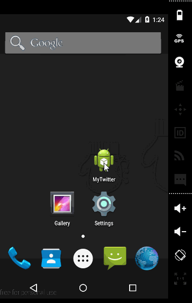

# Simple Twitter Client
CodePath Android Project 3

Basic User Stories:
- [x] User can sign in to Twitter using OAuth login
- [x] User can view the tweets from their home timeline
  - [x] User should be displayed the username, name, and body for each tweet
  - [x] User should be displayed the relative timestamp for each tweet "8m", "7h"
  - [x] User can view more tweets as they scroll with infinite pagination
- [x] User can compose a new tweet
  - [x] User can click a “Compose” icon in the Action Bar on the top right
  - [x] User can then enter a new tweet and post this to twitter
  - [x] User is taken back to home timeline with new tweet visible in timeline

Optional User Stories:
- [x] While composing a tweet, user can see a character counter with characters remaining for tweet out of 140
- [x] Links in tweets are clickable and will launch the web browser (see autolink)
- [x] User can refresh tweets timeline by pulling down to refresh (i.e pull-to-refresh)
- [x] User can open the twitter app offline and see last loaded tweets
  - [x] Tweets are persisted into sqlite and can be displayed from the local DB
- [x] User can tap a tweet to display a "detailed" view of that tweet
- [ ] User can select "reply" from detail view to respond to a tweet
- [ ] Improve the user interface and theme the app to feel "twitter branded"
- [x] User can see embedded image media within the tweet detail view
- [x] Compose activity is replaced with a modal overlay

Walkthrough

