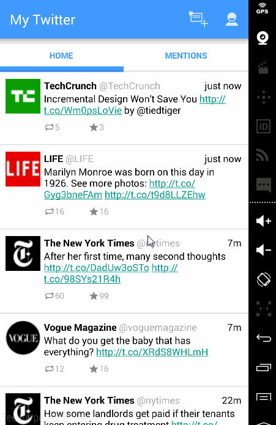

# Twitter Client 
CodePath Android Project 4

Basic User Stories:
- [x] Includes all required user stories from Week 3 Twitter Client
- [x] User can switch between Timeline and Mention views using tabs.
  - [x] User can view their home timeline tweets.
  - [x] User can view the recent mentions of their username.
- [x] User can navigate to view their own profile
	-[x] User can see picture, tagline, # of followers, # of following, and tweets on their profile.
- [x] User can click on the profile image in any tweet to see another user's profile.
  - [x] User can see picture, tagline, # of followers, # of following, and tweets of clicked user.
  - [x] Profile view should include that user's timeline
  - [ ] Optional: User can view following / followers list through the profile
-[x] User can infinitely paginate any of these timelines (home, mentions, user) by scrolling to the bottom

Walkthrough

